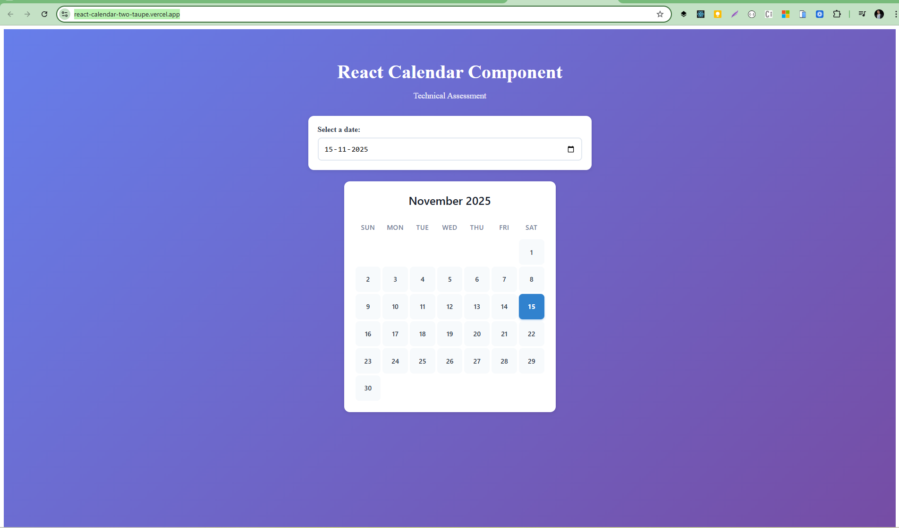

# React Calendar Component

[](https://react-calendar-two-taupe.vercel.app/)
[](https://www.typescriptlang.org/)
[](https://reactjs.org/)
[](https://vitejs.dev/)
[](https://opensource.org/licenses/MIT)

> Technical Assessment - Front End Engineer Position

A reusable React calendar component built with TypeScript, showcasing clean code architecture, comprehensive testing, and modern development practices.

## 🚀 Live Demo

**[View Live Demo →](https://react-calendar-two-taupe.vercel.app/)**

Experience the calendar component in action with interactive date selection and real-time rendering.

## 📸 Preview



*Interactive calendar component with date highlighting and responsive design*

---

## 🎯 Features

- ✅ Reusable `<Calendar date={Date} />` component
- ✅ TypeScript for type safety
- ✅ Comprehensive test coverage with Vitest
- ✅ Accessible with ARIA labels
- ✅ Responsive design
- ✅ Clean separation of concerns
- ✅ Functional programming approach

## 🚀 Getting Started

### Installation

```bash
npm install
```

### Development

```bash
npm run dev
```

Visit: http://localhost:5173

### Testing

```bash
# Run tests
npm test

# Run tests with UI
npm run test:ui

# Run tests with coverage
npm run test:coverage
```

### Build

```bash
npm run build
```

## 📋 Requirements Checklist

- [x] Reusable calendar component with `date` prop
- [x] First row displays month and year
- [x] Second row displays days of the week
- [x] Following rows display dates aligned with day headings
- [x] Appropriate date cell highlighted based on `date` prop
- [x] Component tests with react-testing-library
- [x] Good code and component separation of concerns
- [x] Careful consideration of types (TypeScript)
- [x] Functional programming techniques
- [x] Clear and easy to understand code

## 🏗️ Architecture

### Component Structure

```
Calendar/
├── Calendar.tsx           # Main component logic
├── Calendar.module.css    # Scoped styles
├── Calendar.test.tsx      # Comprehensive tests
├── Calendar.types.ts      # TypeScript interfaces
└── index.ts              # Public exports
```

### Key Design Decisions

1. **TypeScript**: Strong typing for props and internal data structures
2. **CSS Modules**: Scoped styling to prevent conflicts
3. **Functional Programming**: Pure functions for calendar logic
4. **Accessibility**: ARIA labels and semantic HTML
5. **Separation of Concerns**: Types, logic, styles, and tests in separate files
6. **Vitest**: Modern, fast testing framework

## 🧪 Test Coverage

The component includes 20+ test cases covering:

- Month and year rendering
- Day names display
- Date alignment with weekdays
- Date highlighting
- Leap years
- Different month lengths
- Edge cases (first/last day)
- Accessibility attributes
- Error handling

## 💻 Usage

```tsx
import Calendar from './components/Calendar';

function App() {
  return <Calendar date={new Date(2022, 9, 3)} />;
}
```

## 🌐 Deployment

This project is deployed on Vercel with continuous deployment enabled:

- **Production URL**: [https://react-calendar-two-taupe.vercel.app/](https://react-calendar-two-taupe.vercel.app/)
- **Auto-deploy**: Pushes to `main` branch trigger automatic deployments
- **Preview URLs**: Pull requests get unique preview URLs

## 📦 Submission

This solution includes:

- Complete source code
- Comprehensive test suite
- Type definitions
- Documentation
- Clean git history
- Live deployment

## 🎨 Visual Design

The calendar features:

- Clean, modern UI
- Responsive layout
- Hover effects
- Visual feedback for highlighted dates
- Professional color scheme

## 🔧 Technologies

- **React 18**: Latest React features
- **TypeScript**: Type safety and better DX
- **Vite**: Fast build tool
- **Vitest**: Modern testing framework
- **CSS Modules**: Scoped styling
- **Vercel**: Deployment and hosting

## 📝 Development Time

Completed in approximately 2 hours as per requirement.

## 👤 Author

**Shanti Lal**  
Senior Software Engineer  
Technical Assessment for IT Firm

---

*Built with attention to detail, clean code principles, and modern React best practices.*

## 🔗 Links

- **Live Demo**: [https://react-calendar-two-taupe.vercel.app/](https://react-calendar-two-taupe.vercel.app/)
- **GitHub Repository**: [Add your GitHub URL here]

## 🎯 Final Checklist

Before submitting:

- [x] All tests passing
- [x] TypeScript compiles without errors
- [x] Code is well-documented
- [x] Follows functional programming principles
- [x] Good separation of concerns
- [x] README is complete
- [x] No console errors/warnings
- [x] Deployed on Vercel
- [x] Live demo accessible

## 🚀 Commands Reference

```bash
# Setup
npm create vite@latest react-calendar -- --template react-ts
cd react-calendar
npm install
npm install -D @testing-library/react @testing-library/jest-dom @testing-library/user-event jsdom vitest @vitest/ui

# Development
npm run dev          # Start dev server
npm run build        # Build for production
npm run preview      # Preview production build

# Testing
npm test             # Run tests in watch mode
npm run test:ui      # Run tests with UI
npm run test:coverage # Run with coverage report
```